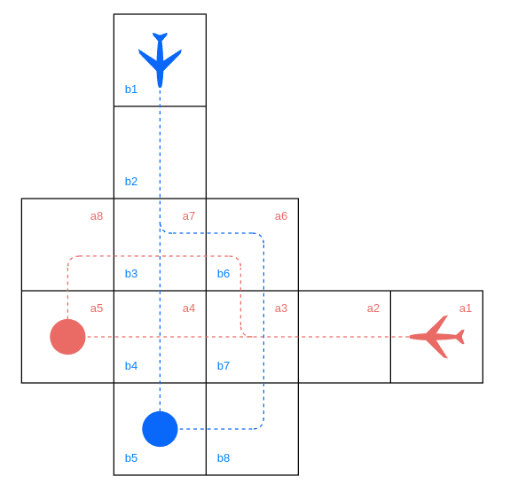

# Air Traffic Control

This scenrio extends the previous [Around the Storm](../around_the_storm/README.md) example to include a more complicated state space.

Rather than a single aircraft navigating through a deterministic airspace (with a potential storm), this example will consider two independent aircraft with intersecting trajectories. This model will allow for the analysis of how to best coordinate the decisions as would an Air Traffic Control system.

## A Visualisation of the Environment

### Behavior of the Aircraft

The behavior of each aircraft is identical to that of the sole aircraft from [Around the Storm](../around_the_storm/README.md).

Each aircraft initially travels directly towards its destination; This initial configuration is a collision course if both aircraft are to maintain their course. 

Each aircraft is capable of altering its course to avoid the intersection of $a_4b_4$ by navigating into $a_6b_6$, introducing a series of new potential collisions.

## Specifications
The primary questions which we should like to answer about this system are as follows

> What is the probability each aircraft can reach their respective destinations without a collision?

> What is the maximum probabilitly of a collision in cell $a_xb_y$?

> What is the total maximum probability of collision?

I have provided PRISM properties in [air_traffic_control.specs](./air_traffic_control.specs) for these specifications.

