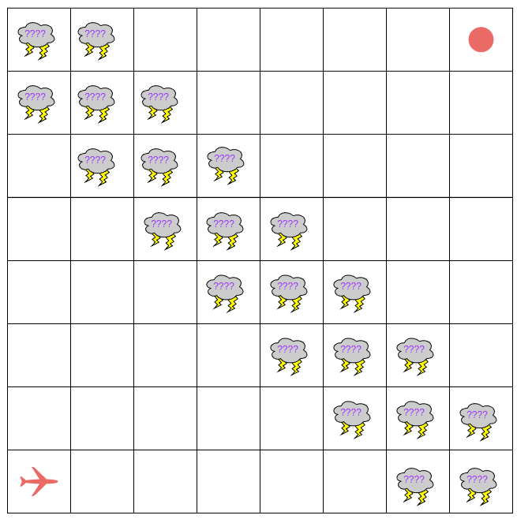
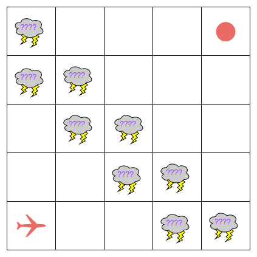

# "Through the Storm"

This scenrio extends each of the previous air traffic control examples to further illustrate the utility of probabilistic analysis.

For this scenario we will consider a single aircraft navigating to its destination. This aircraft will exist in an 8x8 environment with no strict route to the destination. 

Also present in the environment is a large storm cell which will initially block the entire airspace between the aircraft and its destination. Behavior of this storm cell will be explained in later sections.


## A Visualisation of the Environment


### Behavior of the Aircraft
The aircraft will be capable of executing actions [go, turn_left, turn_right] to navigate through the environment. The aircraft will only be capable of travelling right (positive $x$) up (positive $y$).


### Behavior of the Storm
**For the purposes of this experiment we will make some unrealistic assumptions about the behavior of a storm.**
Firstly, the whole storm is divided into individual cells which are each indepenendent markovian processes. This means the behavior of each unit is unaffected by the behavior of any other unit. 

Each storm appear or disappear at each time step.

Each individual cell (and the aircraft) are synchronized so each entity must make a state transition for each time step.

## Specifications
The primary questions which we should like to answer about this system are as follows

> What is the maximum probability of reaching the destination?

> What is the maximum probability of reaching the destination without entering a storm?

> What is the maximum probability of reaching the destination while minimizing contact with storms below some threshold $\phi$?

I have provided PRISM properties in [through_the_storm.specs](./through_the_storm.specs) for these specifications. 


## Problems - State Space Explosion
This scenario is not easy to analyze with STORM due to *state space explosion*.

I have implemented this scenario in [through_the_storm.pm](./through_the_storm.pm). This implementation uses the parallel composition of 22 DTMCs synchronzied with one MDP. The resulting non-deterministic machine has **536870912 states** (which I reduced from a previous version requiring 1073741824 states). Clearly, this is no trivial model. 

Resolving the non-determinism to maximize satisfaction of PLTL specifications is beyond my resources. Therefore I am forced to modify the model.

# Restricting the Model

The *restricted* model will simply reduce the size of the grid from 8x8 to 5x5 and reduce the number of storms in the environment. Behavior of the aircraft and each independent storm cell will remain unchanged.

## A *New* Visualization of the Restricted Model


## State Space
I have implemented this restricted model in [restricted.pm](./restricted.pm). The modifications described above reduce the state space of this model from the previous 536870912 down to 25600. This is a much more manageable size. The same specifications written for the previous model ([through_the_storm.specs](./through_the_storm.specs)) can be used to analyze this reduced model.

## Results

```console
$ prism restricted.pm through_the_storm.specs > restricted.out
```

Results of these computations are given in [restricted.out](./restricted.out).